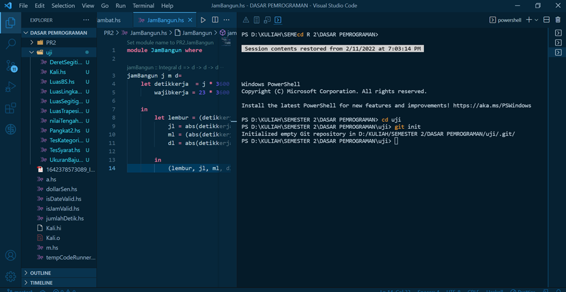
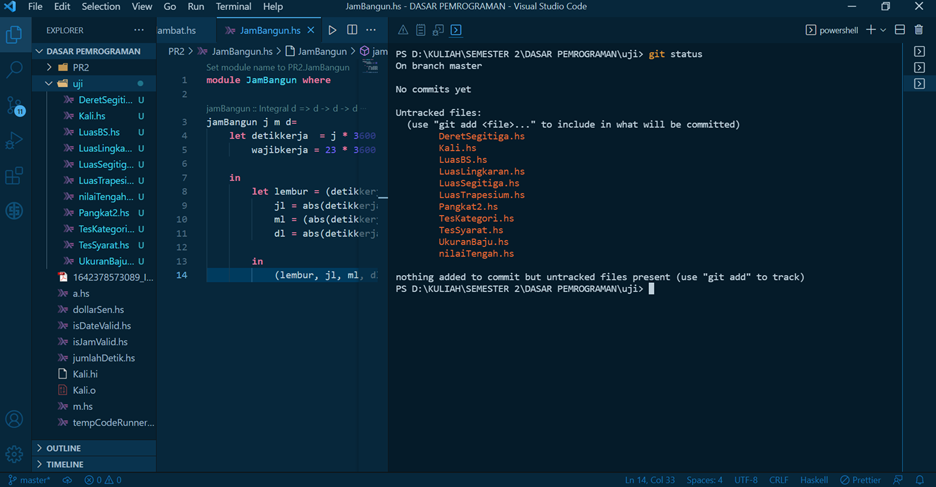
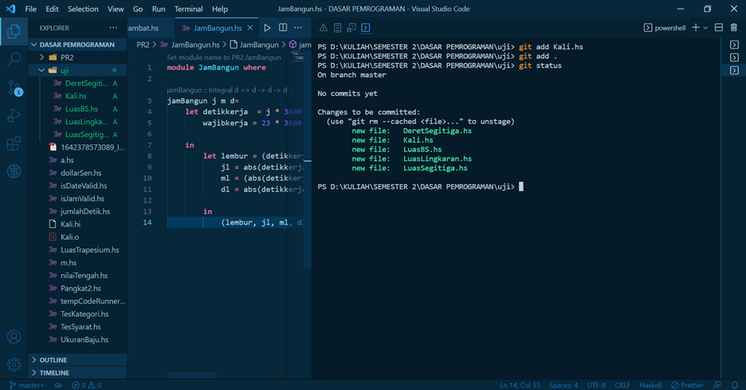
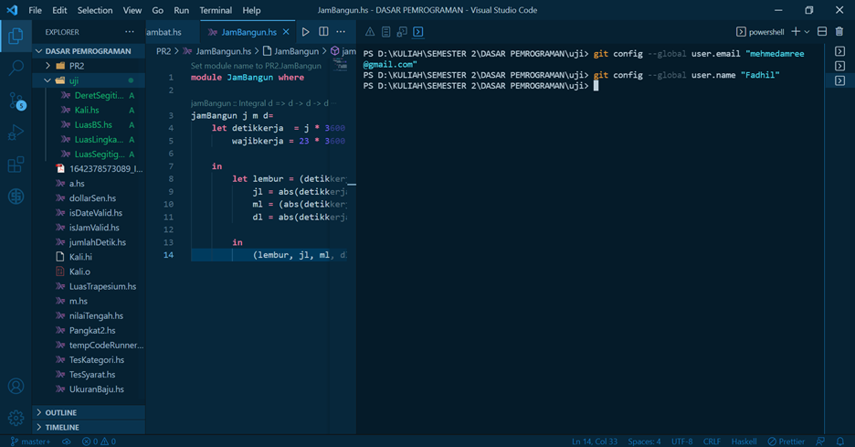
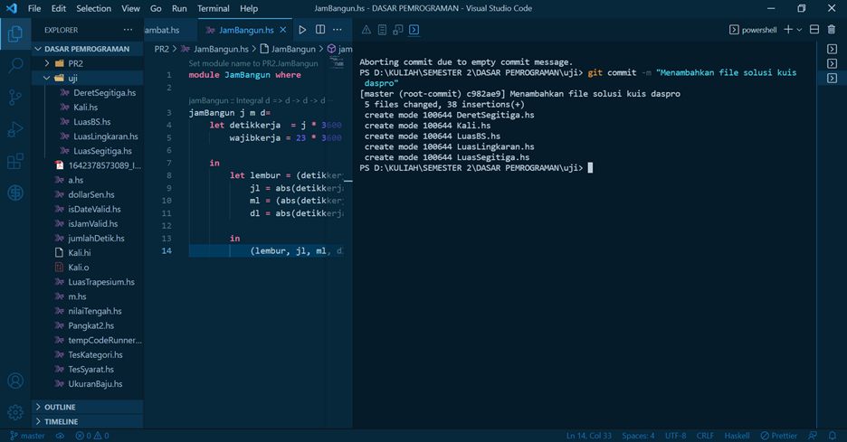
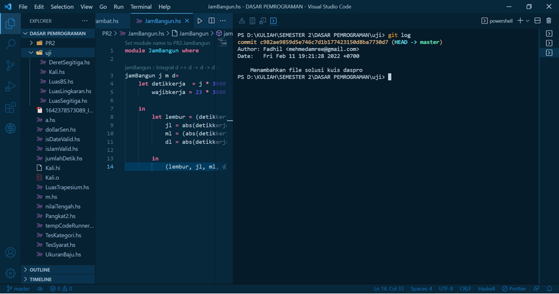

# Bekerja dengan GIT

## Developer:
### 16521336 - Muhammad Fadhil Amri

&nbsp;

## Table of Contents

1. [Install GIT](#install-git)
2. [Area GIT](#area-git)
3. [Menggunakan GIT](#menggunakan-git)

&nbsp;

###	**Install GIT**
 

1.	Masuk ke web Git SCM
2.	Klik download
3.	Install setup
4.	Kustomisasi git bash dan terminal

&nbsp;

###	**Area GIT**

 

GIT memiliki tiga area. Dari ketiga area tersebut, staging area dan history disimpan dalam suatu folder yang Bernama .git. Tiga area tersebut adalah:
1.	*Working Tree Area* bekerja seperti pada saat tidak menggunakan git (seperti file manager bawaan)
2.	*Staging Area*
Area saat memberitahu GIT bahwa kita melakukan suatu perubahaan
3.	*History Area* saat kita telah melakukan commit

&nbsp;

###	**Menggunakan GIT**
 

1.	git init
  

Bertujuan untuk menginialisasi folder .git.
2.	git status
  

Berfungsi untuk menampilkan status perubahan. 
3.	git add
  

Bertujuan untuk memberi tahu VCS bahwa telah terjadi perubahan dan masuk staging area.
4.	git config
  

Berfungsi untuk memberi identitas dari pelaku commit.
5.	git commit
  

Bertujuan untuk menyimpan file dan perubahannya ke history area.
6.	git log
  

Berfungsi untuk menampilkan data aktivitas yang telah dilakukan pada VCS.

