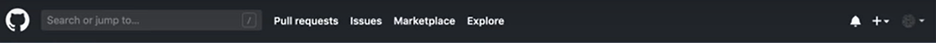
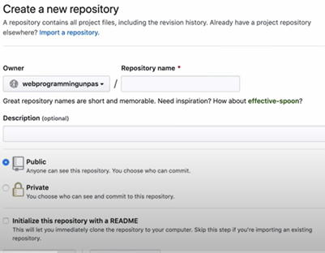
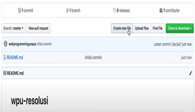
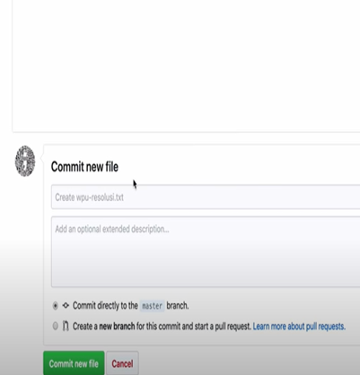
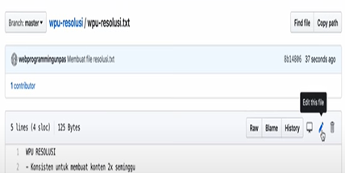
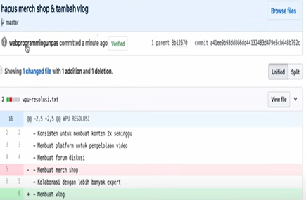
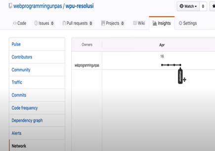

# Bekerja dengan GitHub

## Developer:
### 16521336 - Muhammad Fadhil Amri

&nbsp;

## Table of Contents

1. [Membuat Akun](#membuat-akun)
2. [Membuat Repository dan File](#membuat-repository-dan-file)

&nbsp;

### **Membuat Akun**
 

1. Tekan tombol `Sign Up`
2. Isi `username`, `email`, dan `password`
3. Lengkapi data `personal account`
4. Verifikasi alamat email
5. Tekan tombol `Sign in`

 

&nbsp;

###	**Membuat Repository dan File**

 

1.	Klik tanda `+` lalu pilih `create new repository`
 

2.	Lengkapi spesifikasi dari repository lalu tekan tombol `create`
 

3.	Klik `create new file`
 

4. 	Isi file, lalu `commit new file`
 

5. 	Jika ingin mengedit file tekan tombol ikon pensil, masukkan perubahan, dan `commit changes`
 

 
>> Jika dilakukan penambahan, tanda `+`  akan muncul dan juga muncul warna hijau pada baris yang ditambah, sedangkan jika dilakukan pengurangan, tanda `-` akan muncul dan juga muncul warna merah pada baris yang dikurangi.
 

 

6. 	Untuk melihat perubahan secara visual bisa dilihat pada bagian `insight` -> `network`
 
 
