# GIT BRANCH & MERGE


## Developer:
### 16521336 - Muhammad Fadhil Amri

<p>&nbsp;</p>

## Table of Contents

1. [Branching](#branching)
2. [Checkout](#checkout)
3. [Merging](#merging)
4. [Delete Branch](#delete-branch)


<p>&nbsp;</p>

###	**Branching**
<br>

1. 	Commit file
<br>
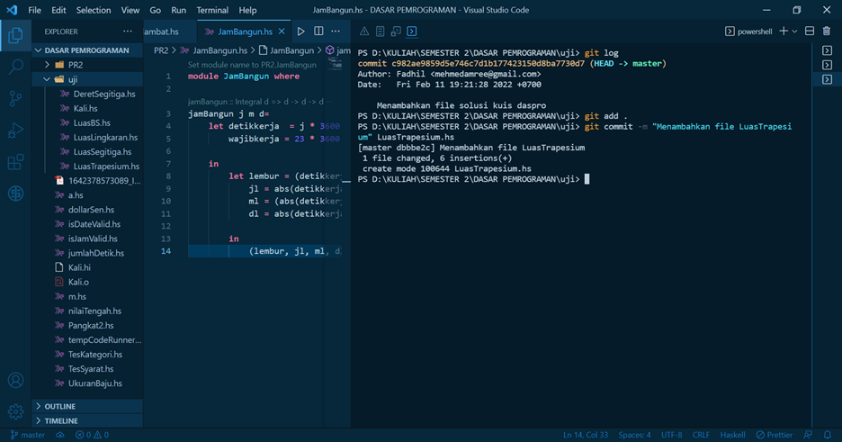

2.	Buat branch  
        ```git branch <nama_branch>```
    <br>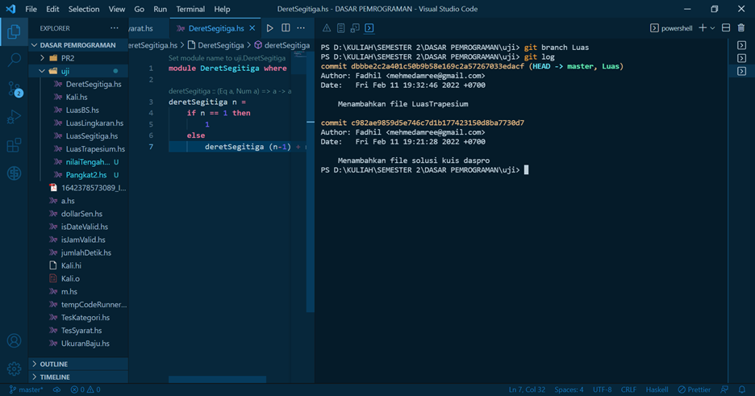

3.	Cek branch tempat head berada
*	    git branch
    <br>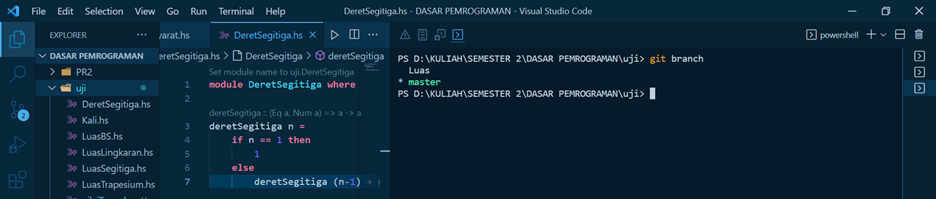 
*	    git log 
    <br>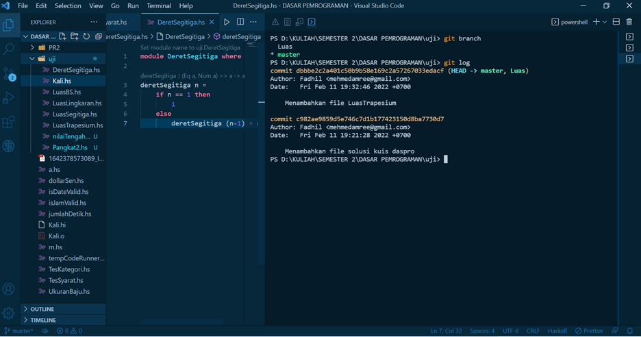

*	    git log --all  --decorate  --oneline --graph
    <br>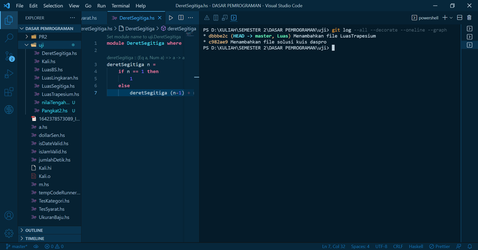

<p>&nbsp;</p>

###	**Checkout** 
<br>

     git checkout <nama_branch_checkout>

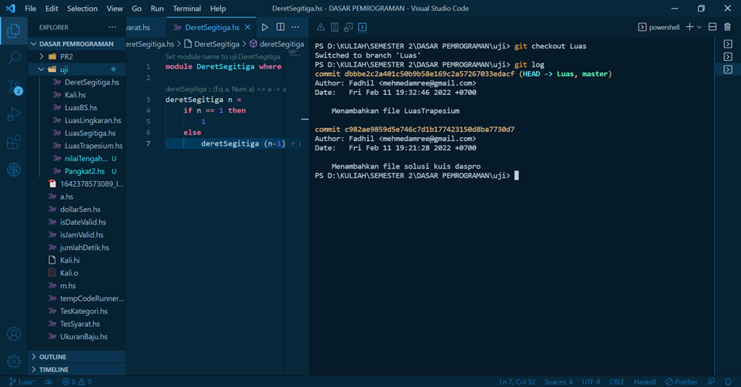

<p>&nbsp;</p>

###	**Merging**
<br>

1.	Fast forward merging
*	Kembali ke branch master
<br>
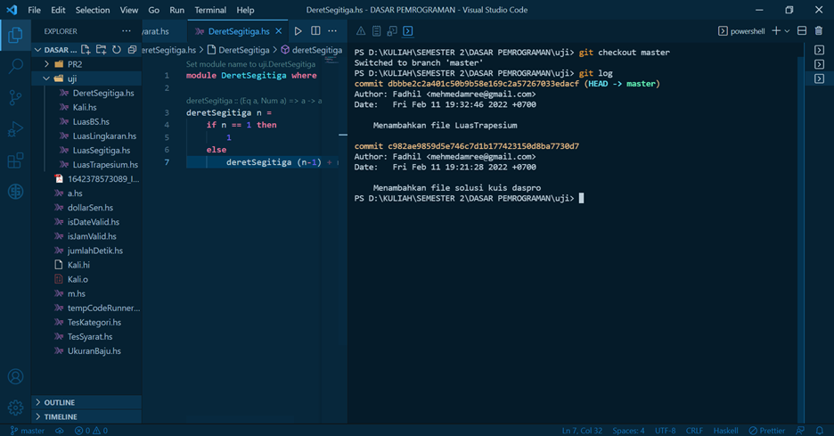
*	Merging menggunakan command:
`git merge nama_branch_yang_akan_dimerge`
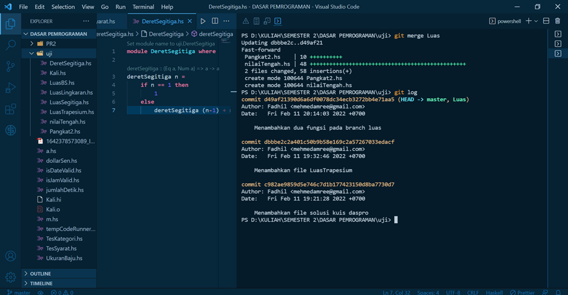
2.	Three way merge
*	Pastikan berada di branch master
<br>
*	Merging menggunakan command:
`git merge nama_branch_yang_akan_dimerge`
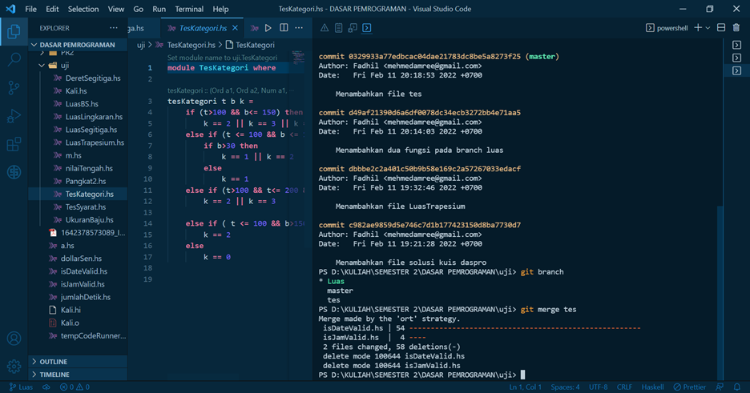
*	Akan muncul message dan konfirmasi

###	**Delete branch**

    git branch -d <nama_branch>
<br> 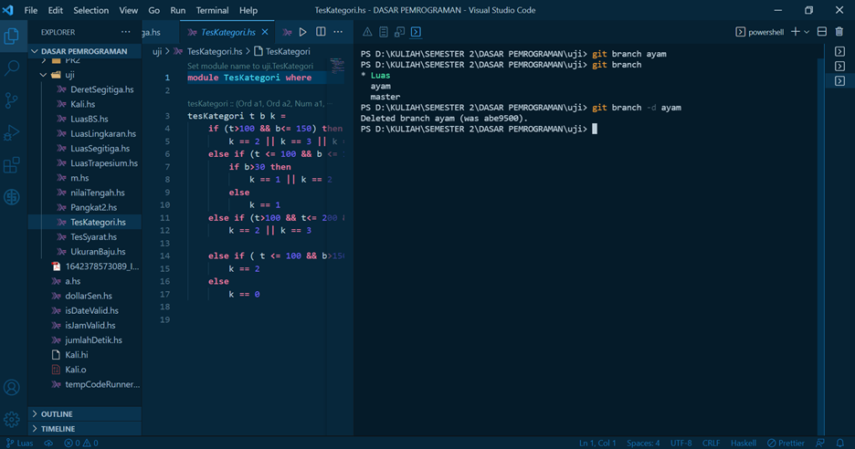
atau untuk menghapus tanpa pengecekan 
    git branch -D <nama_branch>
<br> 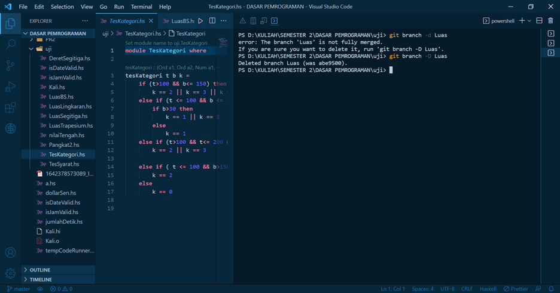


