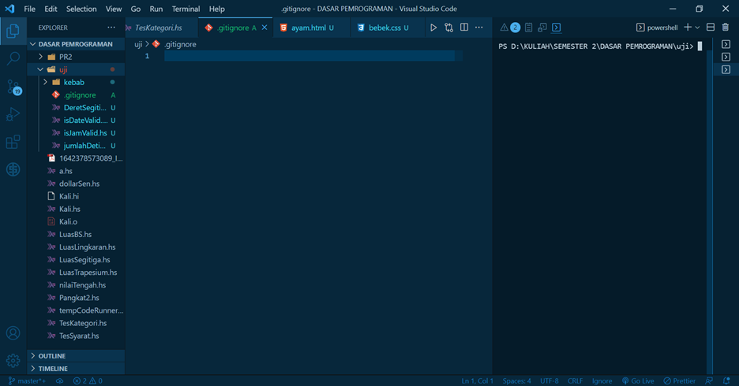
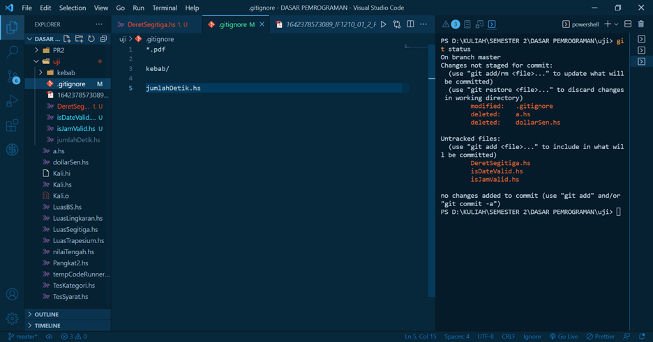

# GitIgnore

## Developer:
### 16521336 - Muhammad Fadhil Amri

&nbsp;

## Table of Contents

1. [Apa itu gitIgnore](#apa-itu-gitignore)
2. [Cara menggunakan gitignore](#gitignore)

&nbsp;

### **Apa itu gitignore?**
 

.gitignore adalah suatu folder yang berfungsi untuk menyembunyikan file/folder tertentu agar tidak ikut terpanggil saat ada command yang memanggil semua file/folder.

&nbsp;

### **Cara menggunakan gitignore**

1.	Buat folder `.gitignore`
 

2.	Tulis nama file / folder / ekstensi yang ingin diabaikan
 
File/folder/ekstensi yang ditulis di file .gitignore diabaikan
