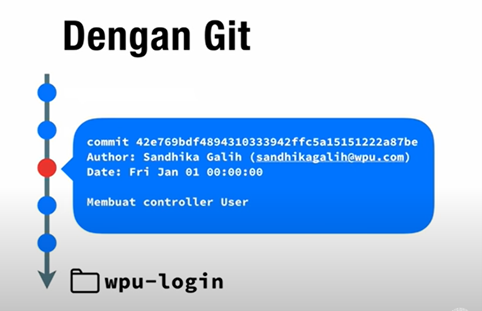
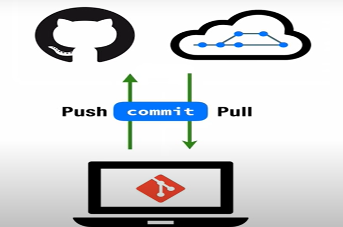

# Apa itu GIT dan GitHub?

## Developer:
### 16521336 - Muhammad Fadhil Amri

&nbsp;

## Table of Contents

1. [Version Control System](#version-control-system-vcs)
2. [GIT](#git)
3. [GitHub](#github)

&nbsp;

### ***Version Control System (VCS)*** 
 

Version Control System adalah suatu sistem yang merekam perubahan yang terjadi pada *source code*. __VCS__ ini memungkinkan penggunanya untuk bekerja berkolaborasi dengan lebih baik. __VCS__ juga memberikan informasi mengenai siapa dan kapan suatu perubahan itu terjadi. Selain itu, __VCS__ juga memberikan fitur *checkout* yang bisa membuat penggunanya untuk Kembali ke keadaan sebelum perubahan. Contoh dari __VCS__ adalah Git, Subversion, Mercurial, dan CVS.

&nbsp;

### **GIT**
 

GIT adalah *software* untuk mengelola perubahan file di dalam folder (*Repository*). Riwayat perubahan yang dilakukan pada GIT akan disimpan menggunakan serangkaian *commit*.
 
 

Pada setiap *commit* yang dilakukan terdapat *hash*, nama dari author, tanggal dilakukannya *commit* dan pesan *commit* / keterangan. Lebih lanjut, GIT adalah suatu VCS lokal atau VCS yang bekerja pada komputer lokal.

&nbsp;

### **GitHub**
 

GitHub adalah layanan *cloud* untuk menyimpan dan mengelola *project* / repo git. GitHub memungkinkan sekelompok orang untuk berkolaborasi dengan menggunakan GitHub sebagai *remote*, yaitu sumber dari repo. Para kolaborator bisa melakukan *clone* terlebih dahulu agar repo yang ada pada github juga terpasang pada komputer lokal mereka. Setelah itu, para kolaborator bisa melakukan *pull* untuk mengambil *commit* dari repo GitHub dan juga bisa melakukan *commit* ke repo GitHub.
 

 
